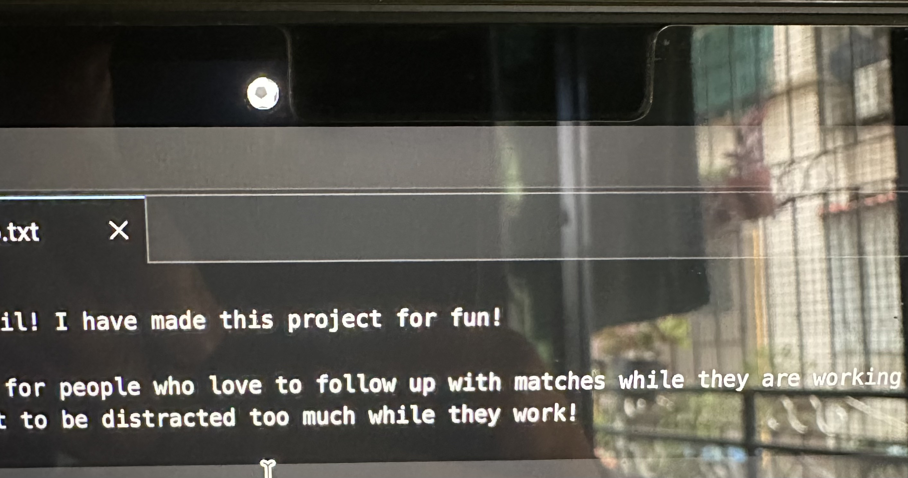
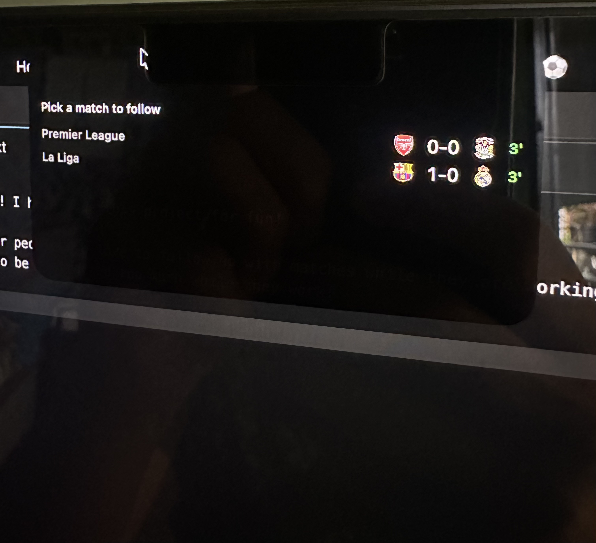
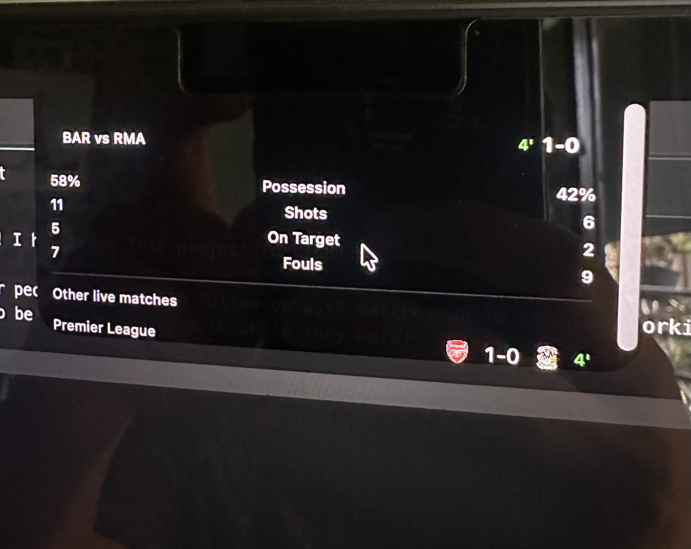
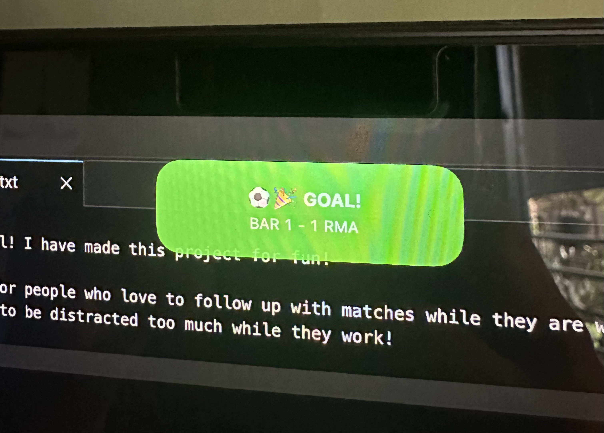

# Football Notch for MacBook



A native macOS menu-bar companion that turns your MacBook's notch into a
Dynamic-Island-style overlay for live football scores: a compact pill
showing the match you're tracking, a hover-to-expand panel with stats and a
match picker, and goal-celebration alerts, pulling real data from ESPN's
live scoreboard API.

Tracks: Premier League, La Liga, Serie A, Bundesliga, Ligue 1, Champions
League, Europa League, and the FIFA World Cup, polled continuously like the
others. ESPN's own API simply returns nothing for the World Cup outside an
actual tournament window (there's no special date-gating logic in this app).

Inspired by [this video](https://youtube.com/shorts/fas3RUgIGA4?si=OD20bPoXfSfmffOZ).


## It in action


Full-length version with sound: [Assets/demo.mp4](Assets/demo.mp4)

## Install

```bash
brew install --cask MoSahil147/football-notch/football-notch
```

or tap first:

```bash
brew tap MoSahil147/football-notch
brew install --cask football-notch
```

No Xcode, no Apple Developer account, and no security warning needed on
your end, everything below this is only for building from source instead.

## Requirements

- A **notched MacBook**: MacBook Pro 14"/16" (2021+) or MacBook Air
  13"/15" (M2+). It will build and run on other Macs, but there's no notch
  to overlay, so the panel won't appear (see [Known limitations](#known-limitations)).
- **macOS 14 (Sonoma)** or later.
- **Xcode 15+**. Get it from the
  [Mac App Store](https://apps.apple.com/app/xcode/id497799835), or via the
  [`xcodes`](https://github.com/XcodesOrg/xcodes) command-line tool, which
  downloads directly from Apple's own servers rather than a redistributed
  copy (there is no plain `brew install xcode`, since Apple doesn't allow
  Xcode itself to be redistributed through Homebrew):
  ```bash
  brew install xcodesorg/made/xcodes
  xcodes install --latest
  ```
- [**XcodeGen**](https://github.com/yonaskolb/XcodeGen): the `.xcodeproj`
  is generated from `project.yml`, not checked in as a hand-maintained
  project file.
  ```bash
  brew install xcodegen
  ```

No API keys or paid accounts are needed to build and run. ESPN's scoreboard
endpoints used here are public, unauthenticated, and unofficial.

## Getting started

1. **Clone the repo:**
   ```bash
   git clone <this-repo-url>
   cd Football-Notch-for-MacBook
   ```

2. **Generate the Xcode project:**
   ```bash
   cd FootballNotch
   xcodegen generate
   ```
   Run this again any time you pull changes that add, remove, or rename
   source files. The `.xcodeproj` itself isn't committed, only `project.yml`.

3. **Open it:**
   ```bash
   open FootballNotch.xcodeproj
   ```

4. **Run it**: ⌘R in Xcode. The app has no Dock icon and no regular window
   by design (`LSUIElement`); it runs as a background accessory app. On
   first launch you'll see a small football emoji pill sitting at your
   MacBook's camera notch, and a small ⚽️ icon appears in the system menu
   bar (top right of the screen) as the only other visible trace of it.

## Using it

- **Hover the notch** to expand it and see live matches across all tracked
  competitions.

  
- **Tap a match**, then pick which team you're supporting. That choice is
  what determines whether a goal shows a celebration or a "conceded" alert.
- Once following a match, the pill shows `TEAM vs TEAM` on the left and the
  score (plus live minute) on the right, split across the notch so neither
  side is hidden behind the camera housing.
- **Hover again** any time to see match stats (possession, shots, fouls), a
  running goal log, and the picker to switch matches.

  
- Goals trigger a pop-up alert with a sound (`Hero` for your team scoring,
  `Basso` for conceding) that auto-collapses after a few seconds. The same
  sounds play for the final result when the match ends (win or loss; a draw
  is silent).

  
- **To quit the app**, click the ⚽️ icon in the system menu bar and choose
  "Quit Football Notch". There's no Dock icon to right-click and no window
  to close, so this menu bar icon is the only way to stop it short of
  Activity Monitor.

Note: matches appear in the picker once live, or from 15 minutes before
kickoff, not only once ESPN itself marks them as in progress. Outside of an
actual live match window, the picker will correctly show
"No matches available". That's expected, not a bug. See
[Testing without a live match](#testing-without-a-live-match-demo-mode)
below.

## Running the tests

```bash
cd FootballNotch
xcodegen generate
xcodebuild -project FootballNotch.xcodeproj -scheme FootballNotch \
  -configuration Debug -destination 'platform=macOS' test
```

Or in Xcode: ⌘U. All logic (geometry maths, ESPN JSON decoding, the goal and
match-outcome detectors, polling, persistence, panel state transitions) is
covered by `FootballNotchTests`. UI views (SwiftUI) are exercised through the
app itself rather than snapshot-tested.

## Testing without a live match (demo mode)

Real matches only happen when a tracked competition is actually playing,
which makes it inconvenient to test the full idle to pick-a-match to track
to goal-alert flow on demand. `DemoESPNClient` (debug-only, compiled out of
Release builds entirely) substitutes canned live-match data for ESPN's real
API, exercising the exact same production code path (`MatchPollingService`,
`GoalDiffDetector`, `AppState`, and so on) with fake data instead of real
network calls.

**To enable it:**

1. In Xcode: `Product` → `Scheme` → `Edit Scheme…`
2. Select `Run` in the sidebar, then the `Arguments` tab
3. Under `Environment Variables`, click `+` and add:
   - Name: `FN_DEMO_MODE`
   - Value: `1`
4. Run (⌘R).

With demo mode on:

- Two fake live matches are available immediately: **Barcelona vs Real
  Madrid** (La Liga) and **Arsenal vs Coventry** (Premier League), both with
  real crest images, both starting at minute 0.
- Roughly every 3rd poll (about 36 seconds while actively tracking), one
  side scores, giving enough time to see the compact pill, hover stats, and
  goal log update, then watch the actual goal-alert animation and sound
  fire.
- **Every launch starts completely fresh**: demo mode automatically clears
  any previously followed match on startup, so you always get the full
  picker flow from the beginning rather than picking up a leftover match
  from a previous test run.

**To go back to real ESPN data**, delete the `FN_DEMO_MODE` environment
variable (or set it to `0`) and re-run.

## Project structure

```
FootballNotch/
  FootballNotch.xcodeproj/   (generated: run `xcodegen generate`, don't hand-edit)
  project.yml                 xcodegen spec, the actual source of truth for the project
  FootballNotch/
    App/                      App entry point, AppDelegate, AppState (display-mode state machine), MenuBarController (the ⚽️ menu bar icon and Quit item)
    NotchWindow/               NotchGeometry (screen/notch maths), NotchPanel (the overlay NSPanel)
    Models/                    Team, Match, MatchStatus, MatchStats
    Networking/                ESPNEndpoints, ESPN response DTOs and tolerant decoding, ESPNClient
    Polling/                   MatchPollingService, GoalDiffDetector, MatchOutcomeDetector
    Persistence/                FollowedMatchStore (UserDefaults), CrestCache (disk and memory image cache)
    UI/                        All SwiftUI views: CompactPillView, HoverExpandedView, GoalAlertView, etc.
    Audio/                     GoalSoundPlayer, UISoundPlayer (macOS system sounds, no bundled audio assets)
    Debug/                     DemoESPNClient, #if DEBUG only, never compiled into Release
  FootballNotchTests/          Unit tests for everything except the SwiftUI views themselves
Distribution/                  Homebrew packaging scaffolding (see below)
JOURNAL.md                     Full development history: what was built, what broke, and why
```

## Known limitations

- **Notch width** is a fixed approximation (`NotchGeometry.approximateNotchWidth`),
  calibrated against one specific MacBook. There is no public API for notch
  *width* (only height, via `safeAreaInsets`), so spacing may be imperfect
  on other notched models. Not verified beyond the device this was built on.
- **Non-notched Macs** (older MacBooks, desktops, or a notched MacBook
  driving only an external display) aren't gracefully handled yet. The
  panel still tries to show using a meaningless fallback position rather
  than simply staying hidden.
- **Goal scorer names** aren't shown, only which team scored. ESPN's
  summary endpoint isn't parsed for individual scorer data.
- **Match stats field names** (`possessionPct`, `totalShots`, etc.) are
  based on ESPN's documented-by-observation shape and haven't been verified
  against a real in-progress match with live stats yet (only against
  scheduled or finished matches, which don't carry stats).

See `JOURNAL.md` for the full history of what was tried, what broke, and
why: useful context before changing `NotchWindow/` or `Networking/` in
particular.

## Distribution

Already published, no Apple Developer account used: an ad-hoc signed build,
released on GitHub, installed via the
[homebrew-football-notch](https://github.com/MoSahil147/homebrew-football-notch)
tap (the `Install` section above). To cut a new release yourself, run
`Distribution/build_release.sh`, which builds and zips the app and prints
the checksum needed for the Cask file. See `JOURNAL.md` for the full
publishing history and `Distribution/` for the scripts and Cask template,
including the optional paid-Developer-ID signing path.

## Licence

MIT: see `LICENSE`.
